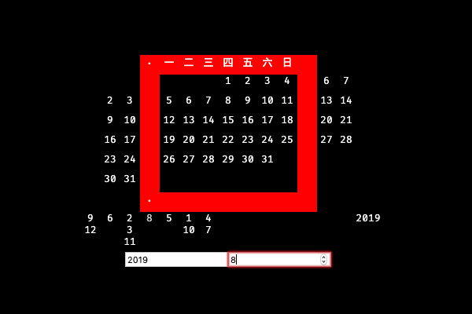

# Slidelendar

A somewhat cool looking but useless [calendar webpage](https://pyxidatol-c.github.io/Slidelendar/);
a practice project using [elm](https://elm-lang.org).

## What is this

I found this notebook with an interesting calendar on it:

You can slide the red frame to see the days of a month.

It sounded like a good first project, so I implemented the sliding calendar - "slidelendar" - in elm:

Yeah that's it.
